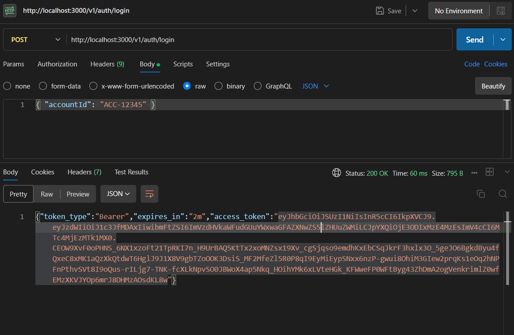
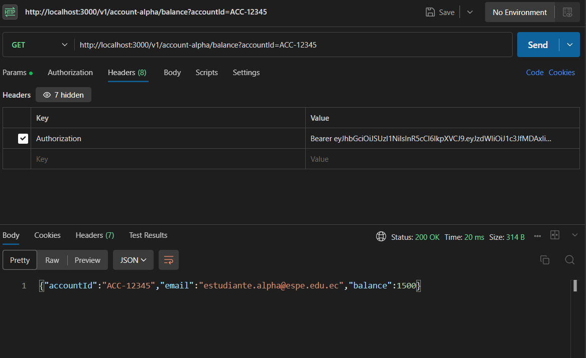
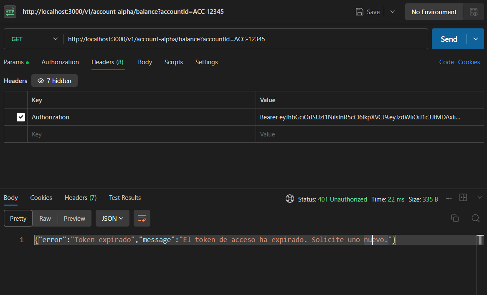
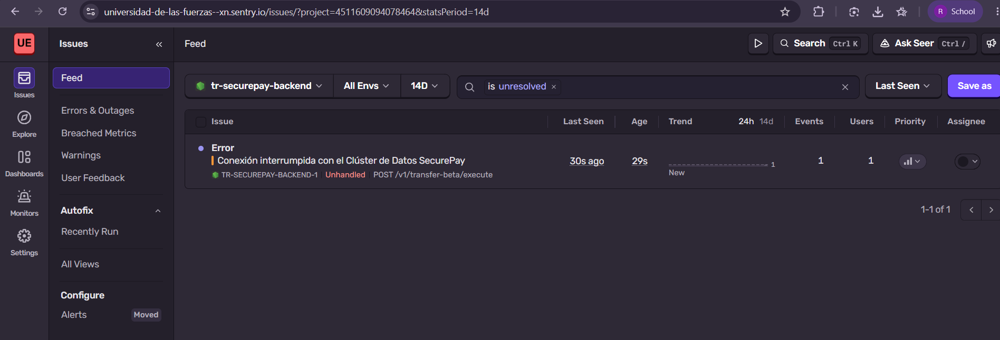
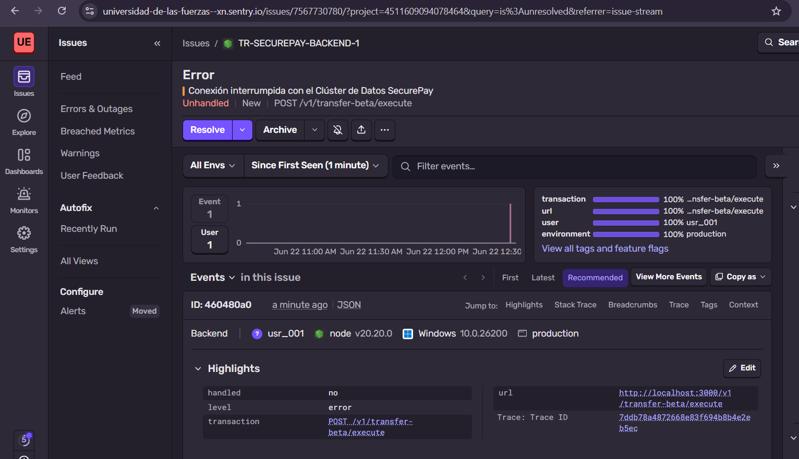
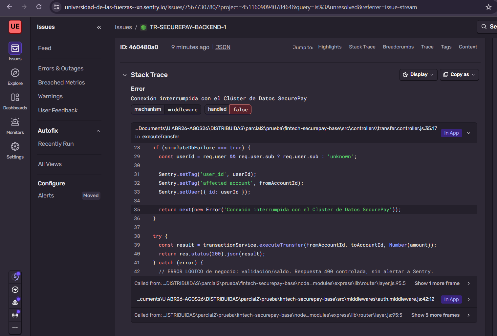
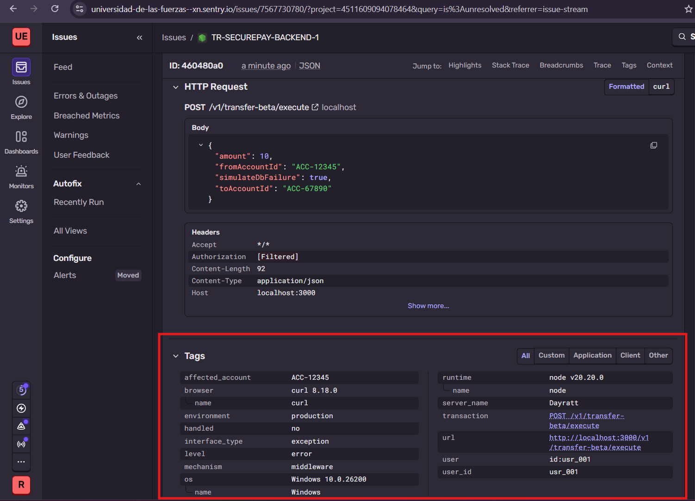
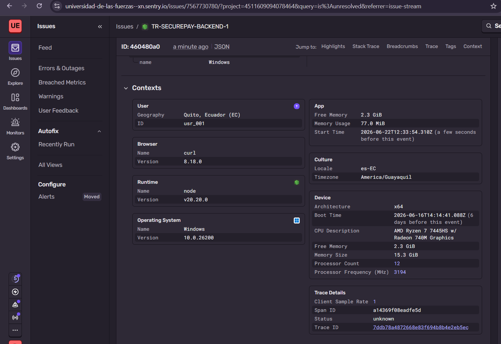

# Fintech "SecurePay" — Backend Distribuido Seguro

Evaluación Parcial Práctica — Arquitecturas Distribuidas (ESPE)
Autora: **Reishel Tipan**

Refactorización del backend monolítico heredado de la plataforma de pagos **SecurePay**, aplicando SRP/DIP, autenticación asimétrica stateless (JWT RS256) y observabilidad con Sentry.

---

## Tabla de Contenido
- [Instalación y ejecución](#instalación-y-ejecución)
- [Fase 1 — Refactorización SOLID (SRP & DIP)](#fase-1--refactorización-solid-srp--dip)
- [Fase 2 — Autenticación Asimétrica Stateless (JWT RS256)](#fase-2--autenticación-asimétrica-stateless-jwt-rs256)
- [Fase 3 — Observabilidad & Error Tracking (Sentry)](#fase-3--observabilidad--error-tracking-sentry)
- [Bitácora de Evidencias](#bitácora-de-evidencias)

---

## Instalación y ejecución

```bash
git clone <enlace_repositorio>
cd fintech-securepay-base
npm install

# Generar el par de llaves asimétricas (PKCS#8) con OpenSSL
./keypair.sh            # genera private.pem y public.pem (NO se versionan)

# Crear el archivo de entorno a partir del esquema
cp .env.example .env    # y completar SENTRY_DSN

npm start
```

> **Seguridad:** `.env` y las llaves `*.pem` están en `.gitignore` y **nunca** se suben al repositorio. Solo se versiona `.env.example` como esquema estructural.

### Endpoints

| Método | Ruta | Protegido | Descripción |
|--------|------|-----------|-------------|
| `POST` | `/v1/auth/login` | No | Emite un JWT RS256 (claims `sub`, `name`, `exp` a 2 min) |
| `GET`  | `/v1/account-alpha/balance?accountId=ACC-12345` | Sí (Bearer) | Microservicio Alpha: saldo de cuenta |
| `POST` | `/v1/transfer-beta/execute` | Sí (Bearer) | Microservicio Beta: ejecuta transferencia |

---

## Fase 1 — Refactorización SOLID (SRP & DIP)

**Rama:** `feature/01-refactor-solid`
**Commit:** `refactor(solid): segregar logica del monolito e inyectar dependencias por constructor`

El monolito `transaction.monolith.service.js` mezclaba 4 responsabilidades. Se descompuso aplicando **SRP** en servicios de bajo nivel independientes y se aplicó **DIP** inyectándolos por constructor mediante un *composition root* (`src/container.js`):

| Componente | Responsabilidad única |
|-----------|----------------------|
| `account.repository.js` | Almacenamiento de estado (cuentas e historial) |
| `verification.service.js` | Verificación financiera y reglas de negocio |
| `notification.service.js` | Notificaciones por consola (email simulado) |
| `transaction.service.js` | **Orquestador**: recibe los 3 anteriores por constructor (DIP) |
| `container.js` | Composition root: instancia e inyecta las dependencias |

Los controladores (`AccountController`, `TransferController`) son clases que reciben el servicio de dominio por **constructor**, dependiendo de abstracciones y no de instancias concretas internas.

---

## Fase 2 — Autenticación Asimétrica Stateless (JWT RS256)

**Rama:** `feature/02-auth-jwt`
**Commit:** `feat(jwt): implementar firmado asimetrico rs256 y middleware de validacion autonoma public-key`

- `keypair.sh` genera con OpenSSL el par `private.pem` / `public.pem` en formato **PKCS#8**.
- `jwt.service.js`:
  - `signToken()` firma con la **llave privada** (`RS256`), payload con claims `sub`, `name` y `exp` a **2 minutos**.
  - `verifyToken()` valida con la **llave pública**, forzando `algorithms: ['RS256']`.
- `auth.middleware.js` intercepta la cabecera, extrae el **Bearer Token** y lo verifica de forma **autónoma/stateless** con la llave pública en los microservicios Alpha y Beta. Token expirado → `401`; token inválido/malformado → `403`.

---

## Fase 3 — Observabilidad & Error Tracking (Sentry)

**Rama:** `feature/03-observabilidad`
**Commit:** `feat(sentry): instrumentar backend y separar manejo de excepciones logicas 401 de fallos operacionales 500`

- `src/instrument.js` inicializa el SDK de Sentry y se importa como la **primera línea** de `index.js`.
- **Error lógico (NO alerta):** token malformado/expirado → respuesta controlada `401/403` en el middleware. No genera crash en el dashboard.
- **Error operacional (SÍ alerta):** en `POST /v1/transfer-beta/execute` se dispara
  `throw new Error("Conexión interrumpida con el Clúster de Datos SecurePay")` →
  error `500` reportado a Sentry mediante `Sentry.setupExpressErrorHandler`, adjuntando como **Tag** personalizado el `user_id` recuperado del JWT (`req.user.sub`).

> El disparador se activa enviando `"simulateDbFailure": true` en el cuerpo de la petición.

---

## Bitácora de Evidencias

### 1. Generación del token (login)


### 2. Acceso válido con token vigente


### 3. Acceso con token expirado


### 4. Sentry — Error Operacional 500 con Tags de usuario


### 5. Sentry — Listado de eventos


### 6. Sentry — Stack trace del error operacional


### 7. Sentry — Tags personalizados (user_id)


### 8. Sentry — Contexto del evento

